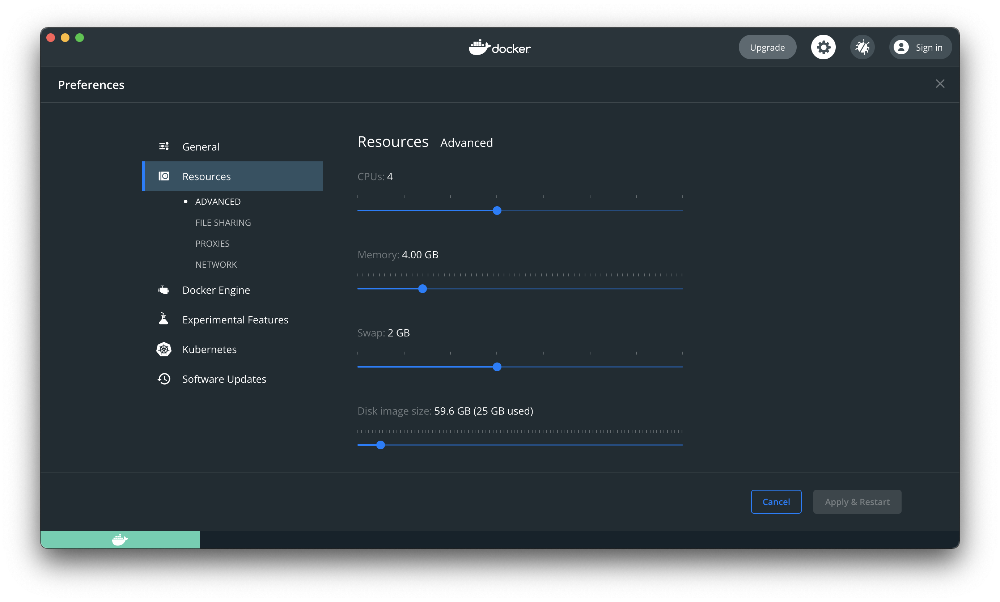

# Keycloak no Docker

Nesta pasta há um arquivo `docker-compose.yaml`, com a configuração mínima necessária para executar o Keycloak com um banco de dados persistente.

## Pré Requisito

Ter instalado o [Docker](https://www.docker.com/products/docker-desktop), configurado para permitir, pelo menos duas CPUs e 3gb de memória RAM.




## Como usar o arquivo?

Para usar execute o seguinte comando no terminal:

```shell
docker compose -p IESB-Keycloak up -d
```
<sub>A inicialização pode levar até alguns minutos. Acompanhe o log</sub>

### Acesso aos logs

Para ver os logs do Keycloak, execute este comando no terminal:

```shell
docker logs -f -n 1000 $(docker ps -f name=IESB-Keycloak --format={{.ID}})
```

## Acessando o Keycloak

Uma vez iniciado, você pode acessar o Keycloak no endereço: [http://localhost:9090/auth/](http://localhost:9090/auth/)

### Credenciais

Para acessar o console de administração, as credenciais são:

- Username: `admin`
- Password: `admin`

## Usando o Keycloak

Lembre-se de seguir os passos apresentados em aula para criação de _realm_, _client_ e _user_.